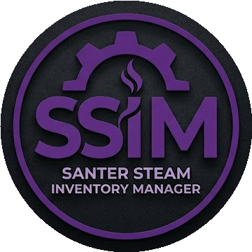
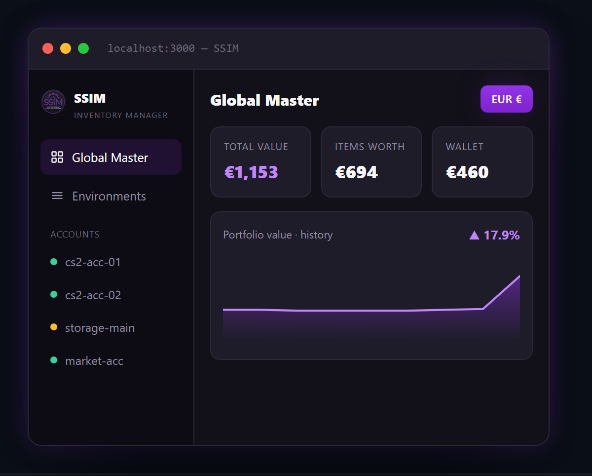
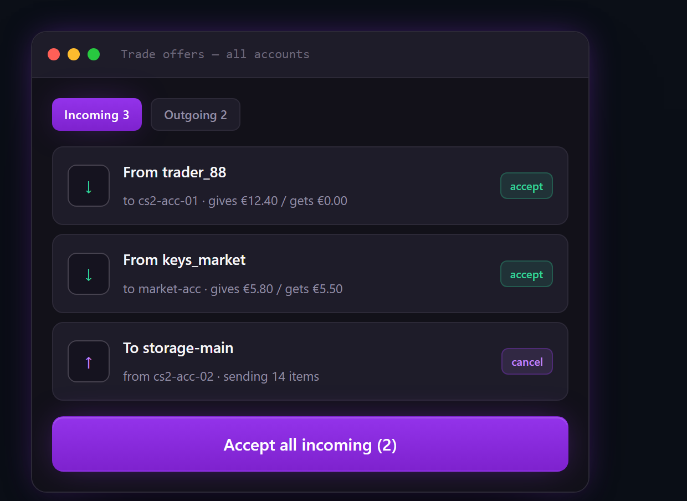

<div align="center">



# SSIM

**Run a 500-account CS2 trading fleet from one dashboard.**

Inventories, trade locks, mass trading, trade offers, and Steam Market buying and
selling — every account in one place. It runs entirely on your PC. Your passwords
and 2FA secrets never leave it.

[](LICENSE)
[](#requirements)
[](test/)

[Download](#install) · [How it works](#how-it-works) · [Security](#security) · [Contributing](CONTRIBUTING.md)



</div>

> [!IMPORTANT]
> **Only download SSIM from the Releases page linked below.** SSIM handles Steam
> passwords and `maFile` 2FA secrets, which makes a fake build wearing its name a
> perfect credential stealer. Builds from forums, Discord DMs, mirror sites, or
> anything advertising itself as "unlocked" or "cracked" are not ours. Verify the
> hash before you run it — see [Verify your download](#verify-your-download).

---

## What it is

SSIM is a desktop app for people who operate **many** Steam accounts and are tired
of logging into them one at a time. It pulls every account's inventory, wallet,
trade locks, market listings, and open orders into a single dashboard, and lets
you act on all of them at once.

It was not built as a demo. **It runs a production fleet of ~544 accounts**, and
most of what's in here exists because something broke at that scale and had to be
fixed properly.

## Features

**Inventory & accounts**
- Every account's CS2 inventory in one view, with per-item trade-lock state
- Storage-unit (casket) contents resolved to real item names
- Bulk account import, encrypted credential vault, per-account proxy support

**Trading**
- Mass trade sending across accounts, with balance and lock checks up front
- One screen for every incoming and outgoing offer, each side priced out
- Batch accept / decline / cancel
- Trade-up contract support



**Market**
- Buy orders placed and confirmed from the dashboard
- Sell at lowest, an undercut, or a fixed net payout — you see the payout before it goes live
- Open buy/sell order tracking and bulk cancel across accounts
- Prices in each account's own wallet currency

**Operations**
- Portfolio value and history across the whole fleet
- CSFloat integration for pricing and listings
- Crash diagnostics that tell you *why* something died, not just that it did

See [FEATURES.md](FEATURES.md) for the complete inventory with file references.

## Install

1. Download `SSIM.exe` from the **[Releases page](https://github.com/Santerxyz/SSIM/releases/latest)**.
2. Verify the hash — [see below](#verify-your-download).
3. Put it in its own folder. It creates `data/`, `Vault/`, `logs/`, and `mafiles/`
   next to itself, so don't drop it in Downloads.
4. Double-click it.

On first run SSIM asks you to set a **master password**. This encrypts your
credential vault. There is no recovery — if you lose it, the vault is gone. Write
it down somewhere safe.

### Verify your download

Every release ships a `SHA256SUMS` file. In PowerShell:

```powershell
Get-FileHash .\SSIM.exe -Algorithm SHA256
```

Compare the result against `SHA256SUMS` from the same release. If it doesn't
match, **delete it and tell us** — open an issue or say something in Discord.

### Requirements

- Windows 10 or 11 (64-bit)
- ~500 MB free disk space
- Steam accounts you control, with their `maFile` 2FA secrets if you want SSIM to
  confirm trades and market listings for you

## How it works

SSIM is a single self-contained `SSIM.exe`: a Tauri shell (Rust) with a Node
backend embedded inside it. On launch the shell extracts the backend, starts it as
a hidden child process, and opens a local dashboard. **Everything runs on your
machine** — the dashboard is served from `localhost`, and there is no SSIM server
involved in normal operation.

SSIM talks to Steam over the same public web endpoints your browser uses.

## Security

This is the part that should decide whether you trust it, so here is the whole
model in plain terms.

**Your credentials stay local.** Passwords and `maFile` secrets live in an
encrypted vault (`Vault/vault.enc`) on your disk — scrypt (N=2¹⁵) key derivation
and AES-256-GCM, keyed off your master password. They are never transmitted
anywhere except to Steam, at login, over TLS.

**No telemetry, no phone-home, no account.** SSIM does not report usage, does not
require registration, and does not contact any server operated by this project
during normal use. The only outbound connections are to Steam, to CSFloat if you
enable it, and to GitHub to check for updates.

**Updates are signature-verified.** The updater checks a SHA-256 hash and an
Ed25519 signature before it will replace the running executable. A tampered update
is rejected.

**The security of the vault does not depend on the code being secret.** That is
precisely why publishing the source costs you nothing: the encryption is standard
and reviewable, and its strength comes from your password, not from obscurity.

**Read the code.** It's 32k lines of TypeScript across 103 files, with
[an architecture map](PROJECT_MAP.md), [documented invariants](INVARIANTS.md), and
308 test files. Start with `src/index.ts`.

Found a vulnerability? See [SECURITY.md](SECURITY.md). Please don't open a public
issue for it.

## Disclaimer

**Use this on accounts you own, at your own risk.**

Steam's Subscriber Agreement restricts automated access. Using SSIM — or any tool
like it — may put your accounts at risk, up to and including losing them. That is
your decision to make, and the consequences are yours.

SSIM is provided **as is, without warranty of any kind**, per the
[Apache License 2.0](LICENSE). The authors are not liable for lost items, lost
funds, locked or banned accounts, or failed trades. Nothing here is financial
advice.

SSIM is not affiliated with, endorsed by, or sponsored by Valve Corporation.

## Contributing

Contributions are genuinely welcome, and the codebase is more approachable than
its size suggests — start with [CONTRIBUTING.md](CONTRIBUTING.md), which points at
the architecture map, the invariants you mustn't break, and issues labelled
`good first issue`.

Building it takes two commands and needs no secrets or keys. See
[docs/BUILD.md](docs/BUILD.md).

## Project status

Maintained on a **best-effort** basis. Issues may go unanswered, and there is no
support guarantee — this is a tool shared freely, not a product with an SLA. If
you'd like to help carry it, that offer is open and real; see
[CONTRIBUTING.md](CONTRIBUTING.md).

## License

[Apache License 2.0](LICENSE) — free to use, modify, redistribute, and fork.

The **name and logo** are not covered by that licence. Fork freely; just give your
fork its own name. See [TRADEMARK.md](TRADEMARK.md) for why (short version: so a
poisoned build can't wear ours).
